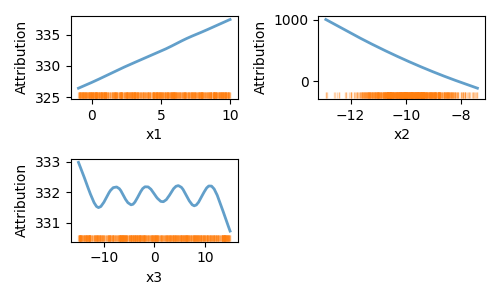
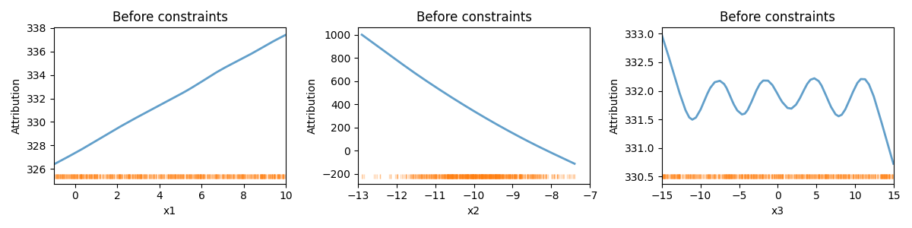
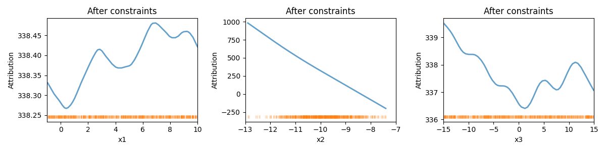
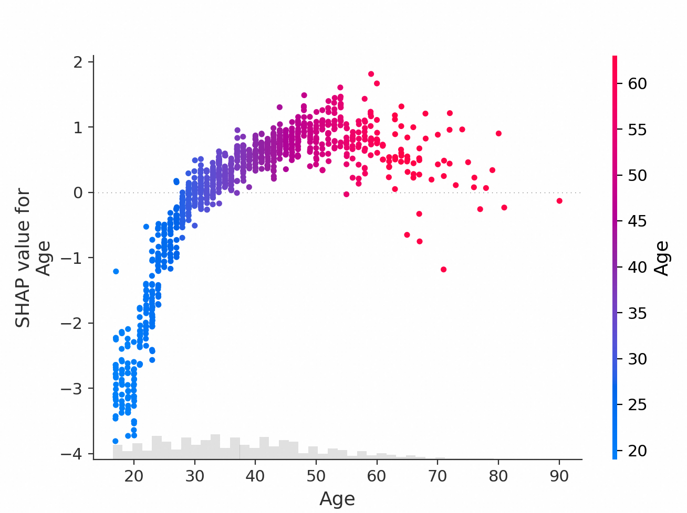
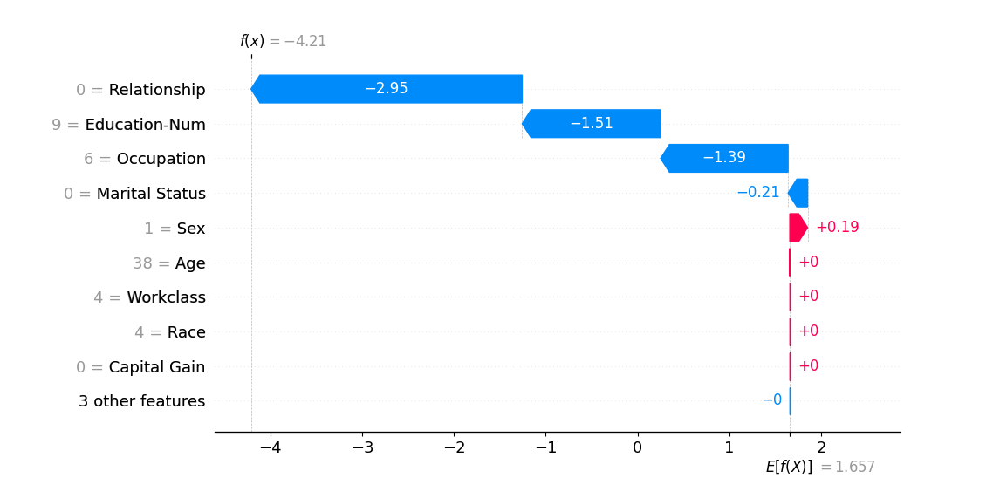

# MindXLib: 可解释机器学习工具包

在AI模型蓬勃发展的今天，"模型为什么会这样预测？"这个问题比以往任何时候都更加重要。"为什么拒绝了这笔贷款？" "用户的什么特点让模型给她推荐这些商品？" "系统是如何判定这个行为异常的？"——在AI时代，这些问题每天都在困扰着工程师和业务人员。

可解释AI (XAI) 正是为解答这些问题而生。XAI就像一位经验丰富的医生，能够通过各种检查手段透视"黑盒模型"的内部运作，并用通俗易懂的语言向用户解释诊断结果。这需要将复杂的数学模型转化为直观的规则、将抽象的特征交互展现为清晰的可视化图表。

基于这样的愿景，达摩院决策智能实验室倾力打造了MindXLib工具包。作为一个全面的可解释AI工具集，MindXLib不仅集成了SHAP、Integrated Gradients等业界主流的解释方法，更包含了我们的多项原创算法：SSRL能将复杂的高维模型提炼为简洁清晰的规则；DIVER能从海量监控数据中快速挖掘出一组精准且相互差异的异常模式，每个模式都具有高置信度和可解释性；交互式GAM通过可解释的形状函数刻画特征影响，并能灵活融入领域知识；FDTempExplainer则创新性地运用函数分解方法，揭示时序数据中的特征交互模式及其对预测的影响。这些工具能够在风控、预测、运维等核心业务场景中广泛应用，让每一个模型决策都清晰可解、可控可信。


## 为什么选择MindXLib？

- **开箱即用**: 简单几行代码即可实现复杂的模型解释；
- **功能全面**: 支持规则学习、特征归因、时序解释等多种解释方法，支持可交互模型编辑；
- **可视化支持**: 内置多种静态、动态可视化方案，直观展示解释结果；
- **统一简洁的接口**: 所有方法遵循统一的调用模式，简单易上手。

## 安装

您可以使用pip安装MindXLib：
`pip install mindxlib`


## 主要方法

MindXLib提供了多种可解释机器学习方法，根据不同的输入数据类型和解释目的，可以选择最适合的方法：

| 方法 | 类型 | 描述 | 
|------|------|------|
| [SSRL](#使用SSRL进行多分类规则学习鸢尾花分类) | 规则挖掘与分类预测 | Sequence Submodular Rule List, 适用于多分类任务[(详情)](#ssrl-sequence-submodular-rule-list) |
| [Diver](#diver-diverse-boolean-rule-learning) | 规则挖掘与分类预测 | Diverse Boolean Rule Learning, 从海量数据中挖掘精准差异化的异常模式[(详情)](#diver-diverse-boolean-rule-learning) |
| [RuleSet](#使用ruleset提取二分类模型的简洁规则信贷风控决策透明化) | 规则挖掘与分类预测 | 适用于二分类任务[(详情)](#ruleset-submodular-rule-set-learning) |
| [RuleSetImb](#使用RuleSetImb处理不平衡数据集的规则学习井字棋胜负预测) | 规则挖掘与分类预测 | 针对不平衡数据的规则学习方法[(详情)](#rulesetimb-imbalanced-rule-set-learning) |
| [GAM](#2-可解释预测白盒预测模型非线性关系贡献分析专家经验融合) | 可解释预测 | Interactive GAM, 通过形状函数进行预测、刻画特征影响，支持领域知识融入[(详情)](#interactive-gam-generalized-additive-model) |
| [FDTempExplainer](#3-时序解释使用fdtempexplainer分析时序特征及其交互对预测结果的影响) | 时序解释 | Functional Decomposition for Temporal Explainer, 分析时序及其交互的重要性[(详情)](#fdtempexplainer-functional-decomposition-for-temporal-explainer) |
| [ShapExplainer](#4-使用shap进行特征归因和可视化) | 特征解释 | 在原shap包基础上提供自定义baseline |
| LimeExplainer | 特征解释 | 较lime包更易上手的接口 |
| IntegratedGradients | 特征解释 | 基于梯度积分的特征归因方法，用于分析深度神经网络的预测结果 |

## 统一接口设计

MindXLib中的方法根据其功能特点提供不同的核心接口：

### 预测类方法（规则学习、GAM）
适用于SSRL、DIVER、RuleSet、GAM等可进行预测的方法：

- **fit(X, y)**: 训练模型
  - X: 输入特征数据
  - y: 目标变量
  - 返回: self，支持方法链式调用

- **predict(X)**: 对新数据进行预测
  - X: 待预测的特征数据
  - 返回: 预测结果

### 解释类方法（SHAP、LIME、IntegratedGradients、FDTempExplainer）
适用于对已有模型进行解释的方法：

- **explain(data, model, \*\*kwargs)**: 生成解释结果
  - data: 待解释的数据
  - model: 待解释的模型
  - 返回: 解释结果对象

### 可视化接口
不同类型的方法有不同的可视化形式：

- **规则学习方法 show()**: 以文本形式展示学习到的规则列表，会打印规则并可选地保存到文件
- **GAM show(mode='static'/'interactive')**: 可视化特征形状函数，支持静态或交互式展示
- **特征归因方法 show(plot_type)**: 支持多种可视化类型，如瀑布图(waterfall)、条形图(bar)、散点图(scatter)等。

### SSRL (Sequence Submodular Rule List)
SSRL是一个基于序列次模 (sequence submodular) 理论的规则列表学习算法。它的核心创新在于将规则列表学习问题重新定义为序列优化问题 (sequence optimization problem)：将规则列表视为有序序列，通过扭曲贪心插入算法 (twisted greedy insertion algorithm) 在MM (Majorization-Minimization) 框架下逐步构建最优规则列表。与传统方法不同，SSRL无需预先挖掘候选规则，而是将规则生成和插入统一到一个优化框架中，这使得它能够高效处理高维数据。在实际应用中，SSRL通常只需3-5条规则就能达到与复杂模型相当的分类准确率，同时保持极强的可解释性，特别适合信贷风控、医疗诊断等对决策透明度要求较高的场景。

```bibtex
@inproceedings{yang2024ssrl,
    author = {Yang, Linxiao and Yang, Jingbang and Sun, Liang},
    title = {Efficient Decision Rule List Learning via Unified Sequence Submodular Optimization},
    year = {2024},
    booktitle = {Proceedings of the 30th ACM SIGKDD Conference on Knowledge Discovery and Data Mining},
    pages = {3758--3769},
    numpages = {12},
    doi = {10.1145/3637528.3671827}
}
```

### DiveR (Diverse Boolean Rule Learning)
DiveR是一种创新的规则学习方法，专注于在保持高准确率的同时，提供简洁且多样化的规则集。与传统的黑盒模型不同，DIVER追求在模型准确性和可解释性之间取得平衡。其核心创新在于将规则的多样性(diversity)作为优化目标之一：通过最小化规则之间的样本重叠度，确保每条规则都能捕捉到数据中独特的模式。这种设计使得DIVER特别适合异常检测、风险识别等需要全面理解不同异常模式的场景。

DIVER的可解释性体现在三个方面：
1. 规则数量最小化：通过优化算法确保只生成必要的规则
2. 规则条件简化：每条规则包含尽可能少的布尔条件
3. 规则多样性：确保不同规则覆盖不同的样本子集，避免冗余

这种多样化的规则集不仅提供了更全面的数据洞察，还能帮助业务人员从不同角度理解和应用模型的决策逻辑。

### Interactive GAM (Generalized Additive Model)
Interactive GAM是一个基于boosting tree的广义加性预测模型。它通过分段线性函数(piecewise linear function)来捕捉特征与目标变量之间的非线性关系。与传统GAM不同，Interactive GAM创新性地引入了领域知识交互机制，允许专家通过直观的界面调整特征形状函数(shape function)，从而将行业经验自然地融入模型中。这种交互式学习方法不仅提高了模型的预测准确性，更重要的是增强了模型在极端场景下的泛化能力。在电力负荷预测(electric load forecasting)等高风险决策场景中，Interactive GAM展现出了优异的性能：它能够准确预测节假日和极端天气下的用电负荷，同时通过清晰的形状函数展示每个特征（如温度、湿度、时间等）对预测结果的具体影响。

```bibtex
@inproceedings{yang2023interactive,
    author = {Yang, Linxiao and Ren, Rui and Gu, Xinyue and Sun, Liang},
    title = {Interactive Generalized Additive Model and Its Applications in Electric Load Forecasting},
    year = {2023},
    doi = {10.1145/3580305.3599848},
    booktitle = {Proceedings of the 29th ACM SIGKDD Conference on Knowledge Discovery and Data Mining},
    pages = {5393--5403},
    numpages = {11}
}
```

### RuleSet (Submodular Rule Set Learning)
RuleSet是一种基于次模优化的规则学习方法。它将规则表示为析取范式(Disjunctive Normal Form, AND-of-ORs)的形式，即一组无序的if-then决策规则的集合。RuleSet将规则学习问题转化为子集选择任务：从所有可能的规则中选择一个子集，以构建准确且可解释的规则集。通过巧妙设计的次模目标函数和高效的优化算法，RuleSet能够在指数级大小的规则空间中快速找到最优解。为了克服处理指数级规则集的困难，规则搜索被转化为另一个特征子集选择问题。通过将子问题的目标函数表示为两个次模函数的差(Difference of Submodular Functions，下称DS)，使其可以通过DS优化算法进行求解。这种基于次模优化的方法简单、可扩展，且能从次模优化领域的进展中持续获益。在实际数据集上的实验表明，该方法能有效地学习出简洁且准确的规则集。

```bibtex
@inproceedings{10.5555/3540261.3542397,
author = {Yang, Fan and He, Kai and Yang, Linxiao and Du, Hongxia and Yang, Jingbang and Yang, Bo and Sun, Liang},
title = {Learning interpretable decision rule sets: a submodular optimization approach},
year = {2021},
booktitle = {Proceedings of the 35th International Conference on Neural Information Processing Systems},
articleno = {2136},
numpages = {13},
series = {NIPS '21}
}
```

### RuleSetImb (Imbalanced Rule Set Learning)
RuleSetImb是一种专门针对高度不平衡数据集的规则学习方法，它通过优化F1分数并施加基数约束来处理样本不平衡问题。该方法能有效处理正负例比例达到1:10的类别不平衡场景。其核心创新在于将规则学习与不平衡处理统一到一个优化框架中：采用贪心策略生成具有最大边际增益的规则，并使用高效的最小化-最大化方法迭代选择规则。这种设计不仅能有效处理类别不平衡问题，还能保持规则的简洁性和可解释性。在实际应用中，RuleSetImb特别适合故障检测、欺诈识别等正例稀少的场景，相比传统方法具有更高的准确性和更好的可解释性，同时支持在线训练，训练开销较小。

```bibtex
@inproceedings{ren2024slim,
author = {Ren, Rui and Yang, Jingbang and Yang, Linxiao and Gu, Xinyue and Sun, Liang},
title = {SLIM: a Scalable and Interpretable Light-weight Fault Localization Algorithm for Imbalanced Data in Microservice},
year = {2024},
doi = {10.1145/3691620.3694984},
booktitle = {Proceedings of the 39th IEEE/ACM International Conference on Automated Software Engineering},
pages = {27–39},
numpages = {13},
series = {ASE '24}
}
```

### FDTempExplainer (Functional Decomposition for Temporal Explainer)
FDTempExplainer是一种创新的模型无关解释方法，专门用于解释时序模型的预测行为。与传统的解释方法不同，FDTempExplainer基于函数分解理论，能够有效处理时序数据的独特特征，尤其是观测值之间的强时序依赖性和交互作用。在时序数据中，不同时间步的数据通常会动态交互，形成影响模型预测的重要模式，而不是孤立地发挥作用。现有的时序解释方法往往将时间步作为独立实体处理，忽略了这些关键的时序交互，导致对模型行为的理解较为表面。

FDTempExplainer在方法论上有三个关键创新：通过严格的数学框架，将时序模型的预测分解为单个时间步的独立贡献和它们之间交互的聚合影响；能够准确测量时序特征之间的交互强度，提供比基准模型更深入的洞察；同时适用于广泛的时序应用场景，包括异常检测、分类和预测等任务。

在实际应用中，FDTempExplainer展现出了全方位的优异性能。该方法不仅能够识别并量化关键时间窗口对预测的影响，还能揭示时序特征之间复杂的交互模式。
```bibtex
@InProceedings{fdtempexplainer2024yang,
  title = 	 {Explain Temporal Black-Box Models via Functional Decomposition},
  author =       {Yang, Linxiao and Tong, Yunze and Gu, Xinyue and Sun, Liang},
  booktitle = 	 {Proceedings of the 41st International Conference on Machine Learning},
  pages = 	 {56448--56464},
  year = 	 {2024},
  volume = 	 {235},
  series = 	 {Proceedings of Machine Learning Research},
  url = 	 {https://proceedings.mlr.press/v235/yang24y.html},
}

```
## 核心功能与应用场景

### 1. 规则学习

#### 使用RuleSet提取二分类模型的简洁规则，信贷风控决策透明化


**效果示例**：
银行需要对贷款申请进行自动审核，同时确保决策过程透明可解释。在这个示例中，我们使用UCI公开的信贷审批数据集进行演示。该数据集包含了真实的信贷申请记录，每条记录包含申请人的各类
信息（如收入、年龄、信用记录等）以及最终的审批结果。我们的目标是从这些历史数据中学习出一组简洁的规则，既能保证较高
的预测准确率，又便于业务人员理解和使用。

RuleSet算法达到了83%的准确率，与XGBoost的基准表现相当，同时提供了简洁可解释的规则：

```python
# 使用UCI信贷审批数据集
from ucimlrepo import fetch_ucirepo
from sklearn.model_selection import train_test_split
from mindxlib import RuleSet
import numpy as np

credit_data = fetch_ucirepo(id=27)
X = credit_data.data.features 
y = credit_data.data.targets

# 数据预处理和模型训练
X.dropna(axis=1, inplace=True)
X_train, X_test, y_train, y_test = train_test_split(X, y, test_size=0.2, random_state=42)

model = RuleSet(
    max_num_rules=5,
    time_limit=60,
    verbose=False,
    feature_prefix='feature_',
    binarize_features=True,
    categorical_features=[],
    num_thresh=3
)
model.fit(X_train, y_train)

# 评估模型效果
y_pred = model.predict(X_test)
acc = np.sum(y_pred.values == y_test.values.flatten()) / y_test.shape[0]
print(f'准确率: {acc:.2f}')  # 输出: 准确率: 0.83

# 展示规则列表
model.show()
```
输出的准确率和规则如下：
```
准确率: 0.83
IF A13 != p AND NOT A9, THEN -, ELSE +
IF A15 <= 155.33333333333303 AND A15 > 0.0 AND A11 <= 0.0 AND A9, THEN -, ELSE +
IF A13 == s AND A9 AND A3 <= 1.5, THEN -, ELSE +
IF A13 == p AND A8 > 0.29, THEN -, ELSE +
```

#### 使用SSRL进行多分类规则学习：鸢尾花分类

**效果示例**：
需要从多个特征中提取简单规则来区分不同类别，如产品质量分级、客户分群等。在这个示例中，我们使用经典的鸢尾花数据集，该数据集包含150朵鸢尾花的测量数据，每朵花都记录了花萼长度、花萼宽度、花瓣长度和花瓣宽度四个特征。

SSRL通过智能特征筛选，仅使用花瓣长度一个特征就构建出了3条简洁的规则：当花瓣长度大于4.83cm时为品种2，小于2.63cm时为品种0，其余情况为品种1。这个简单的规则集实现了完美分类（准确率100%），展示了算法在特征筛选和规则简化方面的优秀能力。

```python
from sklearn.datasets import load_iris
from sklearn.model_selection import train_test_split
from mindxlib import SSRL
import pandas as pd
import numpy as np

# 加载iris数据集
iris = load_iris()
X = pd.DataFrame(iris.data, columns=iris.feature_names)
y = pd.Series(iris.target)

# 数据集分割
X_train, X_test, y_train, y_test = train_test_split(X, y, test_size=0.2, random_state=42)

# 训练SSRL模型
model = SSRL(
    num_thresh=2,
    negation=True
)
model.fit(X_train, y_train)
# 评估模型效果
y_pred = model.predict(X_test)
acc = np.mean(y_pred == y_test)
print(f'准确率: {acc:.2f}')  
# 展示规则列表
model.show()
```

输出的准确率和规则如下：
```
准确率: 1.00
IF petal length (cm) > 4.833333333333331, THEN 2
ELIF petal length (cm) <= 2.633333333333323, THEN 0
ELSE 1
```

#### 使用RuleSetImb处理不平衡数据集的规则学习：井字棋胜负预测

**效果示例**：
在正负样本比例不均衡的场景下进行规则提取，如欺诈检测、异常识别等。这个示例使用井字棋数据集，包含958局游戏的记录，每局记录了9个格子的状态（X、O或空）。其中获胜样本(626个)是失败样本(332个)的近两倍。

RuleSetImb生成的规则直观地反映了井字棋的获胜模式，包括横向、纵向和对角线连成一线的各种情况，如"当0、4、8位置都不是O时获胜"（对角线）和"当0、3、6位置都是X时获胜"（第一列）等。这些规则不仅实现了100%的准确率，更展示了算法在不平衡数据集上的出色表现。

```python
from mindxlib import RuleSetImb
from mindxlib.data import tic_tac_toe
import numpy as np
from sklearn.model_selection import train_test_split

# 加载井字棋数据集
X, y = tic_tac_toe()

# 查看类别分布
print(y.value_counts())
# 1    626  # 正类(获胜)样本数
# 0    332  # 负类(失败)样本数

# 数据集分割
X_train, X_test, y_train, y_test = train_test_split(X, y, test_size=0.2, random_state=42)

# 训练RuleSetImb模型
model = RuleSetImb(
    num_thresh=5,
    negation=True,
    max_num_rules=20,
    beta_diverse=0.01
)
model.fit(X_train, y_train, default_label=0)

# 评估模型效果
predictions = model.predict(X_test)
acc = np.sum(1.0*(predictions.values==y_test.values))/y_test.shape[0]
print(f'准确率: {acc:.2f}')  
model.show()
```

输出的准确率和规则如下：
```
准确率: 1.00
IF 0 != o AND 4 != o AND 8 != o, THEN positive, ELSE negative
IF 2 != o AND 4 != o AND 6 != o, THEN positive, ELSE negative
IF 0 == x AND 3 == x AND 6 == x, THEN positive, ELSE negative
IF 3 == x AND 4 == x AND 5 == x, THEN positive, ELSE negative
IF 0 == x AND 1 == x AND 2 == x, THEN positive, ELSE negative
IF 1 == x AND 4 == x AND 7 == x, THEN positive, ELSE negative
IF 6 == x AND 7 == x AND 8 == x, THEN positive, ELSE negative
IF 2 == x AND 5 == x AND 8 == x, THEN positive, ELSE negative
IF 2 != o AND 3 == b AND 7 != o AND 8 != o, THEN positive, ELSE negative
```

这个例子展示了RuleSetImb在处理不平衡数据集时的优势：
1. 尽管数据集存在明显的类别不平衡（正负类比例约2:1），模型仍然能学习到准确的规则
2. 生成的规则直观地反映了井字棋的获胜模式，包括横向、纵向和对角线连成一线的情况
3. 规则中使用了否定条件（如"!=o"）来描述更复杂的模式，提高了规则的表达能力
4. 在测试集上达到了100%的准确率，说明模型很好地捕捉到了游戏的本质规律

### 2. 可解释预测：白盒预测模型、非线性关系贡献分析、专家经验融合

**主要功能1**：使用分段线性GAM模型进行预测和解释

**效果示例**：
我们使用一个合成数据集来展示GAM模型的预测和解释能力。这个数据集包含三个特征(x1, x2, x3)，它们与目标变量y之间存在不同类型的非线性关系，具体是$y = x1 + 10*x2^2 - sin(x3) + noise$。

```python
from mindxlib import GAM
import numpy as np
import pandas as pd
from sklearn.model_selection import train_test_split
from sklearn.metrics import r2_score

# 生成合成数据
n_samples = 1000
x1 = np.random.uniform(-1, 10, n_samples)  # 线性关系
x2 = np.random.uniform(-10, 1, n_samples)  # 二次关系
x3 = np.random.normal(-15, 15, n_samples)  # 三次函数与正弦复合
noise = np.random.normal(0, 0.1, n_samples)

# 生成目标变量: y = x1 + 10*x2^2 - sin(x3^3) + noise
y = x1 + 10 * (x2 ** 2) - np.sin(x3) + noise

X = pd.DataFrame({
    'x1': x1,
    'x2': x2,
    'x3': x3
})

X_train, X_test, y_train, y_test = train_test_split(X, y, test_size=0.2, random_state=42)
# 训练GAM模型
gam = GAM()
gam.fit(X_train, y_train)

# 评估模型效果
y_pred = gam.predict(X_test)
r2 = r2_score(y_test, y_pred)
print(f'R2: {r2:.8f}')  # 输出: R2: 0.99997292

# 可视化特征影响
gam.show(mode='static')  

gam.show(data = X_test, mode='interactive', intercept=False, waterfall_height='80vh', ci = False) # 交互式可视化
```

**图形说明**：
`gam.show(mode='static')`展示每个特征的形状函数（shape function）。该方法在底层使用matplotlib.pyplot进行绘图，因此支持与pyplot.plot()相同的参数设置，如figsize、color等。生成的静态可视化效果如下：


而`gam.show(mode='interactive')`则提供了更丰富的交互式可视化体验。它会生成一个分为上下两部分的交互式图表，上半部分是瀑布图(waterfall plot)，展示了每个特征对预测结果的贡献大小、正负；下半部分展示了所有特征的形状函数。当用户将鼠标悬停在瀑布图的某个特征柱上时，下方对应的形状函数会自动移到最前面；当鼠标悬停到形状函数曲线上某个点时，曲线会动态显示当前鼠标位置对应的x-y坐标值。这样的交互式可视化可以帮助用户更直观地理解每个特征对预测结果的影响。

GAM模型成功捕捉到了各个特征与目标变量之间的非线性关系：
- x1呈现线性增长趋势
- x2展现出明显的二次曲线特征
- x3显示出正弦周期性变化模式

**主要功能2**：使用交互式GAM模型融合专家经验

通过添加形状约束，我们可以将领域知识融入模型：

```python
# 添加形状约束
gam.add_constraint(-1, 0, 'd', 'x1')
gam.add_constraint(-10, -7, 'c', 'x2')
gam.add_constraint(-30, 0, 'd', 'x3')
# 更新模型
gam.update(X, y)
```


在上述约束下:

- x1在区间[-1,0]被约束为递减(decreasing)。从图中可以看出，施加约束后x1的曲线在该区间内呈现明显的下降趋势，而在其他区间仍保持原有的形状。

- x2在区间[-10,-7]被约束为凹函数(concave)。约束后的曲线在该区间内呈现出向下弯曲的凹形状，这与原始的二次函数（凸形状）形成对比。

- x3在区间[-30,0]被约束为递减(decreasing)。约束后的曲线在负值区间内展现出持续下降的趋势，与原来规律的周期性波动有明显区别。

值得注意的是，由于GAM模型的整体性，对某一区间施加约束可能会影响到其他区间的形状。这是因为模型需要在满足约束的同时保持曲线的拟合性能。
这种约束效应的传播展示了GAM模型在保持全局平滑性的同时满足局部约束的能力。通过适当设置约束，我们可以将业务领域知识融入模型，使其预测结果更符合实际情况。这些约束确保了模型的预测符合业务逻辑，提高了模型在极端场景下的可靠性。GAM模型的业务价值在于能准确建模复杂的非线性关系，直观展示每个特征的边际贡献，支持添加单调性、凸性等形状约束，并提供交互式界面进行模型调整，从而实现更好的可解释性和实用性。

### 3. 时序解释：使用FDTempExplainer分析时序特征及其交互对预测结果的影响

**效果示例**：
我们使用一个合成的时序数据集来展示FDTempExplainer的功能。这个数据集模拟了一个具有时间滞后效应的分类问题，其中不同特征在不同时间步长上对预测结果产生影响。

FDTempExplainer通过分析主效应和交互效应来解释时序模型的预测结果。在主效应分析中，我们可以清晰地看到每个特征在不同时间窗口中对预测结果的独立贡献。这不仅帮助我们识别出最具影响力的特征，还能发现这些特征在哪些时间区间发挥着关键作用。而在交互效应分析中，我们能够理解不同时间窗口之间的特征的的共同作用影响预测值。

从业务角度来看，这种解释方法带来了多方面的价值：它能够量化每个时序特征对预测结果的贡献度，在计算时考虑特征之间潜在的时序依赖关系，识别出关键的时间窗口，并为模型优化提供可靠的依据。这些信息不仅提高了模型预测结果的可解释性，还能帮助业务人员更好地理解和应用模型的预测结果。

```python
import numpy as np
import torch
import torch.nn as nn
from mindxlib.utils.models import LSTM
from mindxlib import FDTempExplainer

def generate_synthetic_data(n_samples, n_feat, n_time):
    """生成具有不同时间滞后效应的合成数据"""
    X = np.random.rand(n_samples, n_feat, n_time)
    Y = np.zeros((n_samples, 4, n_time))
    
    for t in range(n_time):
        effect = X[:, 0, t]  # 当前时间的影响
        if t >= 1:
            effect += 0.7 * X[:, 1, t-1]   # 滞后1期的影响
        if t >= 2:
            effect += 0.4 * X[:, 1, t-2]   # 滞后2期的影响
            
        # 将效果转换为4个类别（使用四分位数）
        bins = np.percentile(effect, [25, 50, 75])
        for i in range(4):
            if i == 0:
                Y[:, i, t] = (effect <= bins[i]).astype(float)
            elif i == 3:
                Y[:, i, t] = (effect > bins[i-1]).astype(float)
            else:
                Y[:, i, t] = ((effect > bins[i-1]) & (effect <= bins[i])).astype(float)
    
    return X, Y

# 生成数据
n_feat, n_time = 2, 6  # 2个特征，6个时间步
X, y = generate_synthetic_data(1000, n_feat, n_time)

# 划分训练集和测试集
from sklearn.model_selection import train_test_split
X_train, X_test, y_train, y_test = train_test_split(X, y, test_size=0.2, random_state=42)

# 训练LSTM模型
model = LSTM(input_dim=n_feat, hidden_dim=120, output_dim=4, num_layers=3, task='classification')
optimizer = torch.optim.Adam(model.parameters(), lr=0.01)
criterion = nn.CrossEntropyLoss()

# 转换为PyTorch张量
X_train_tensor = torch.FloatTensor(X_train)
y_train_tensor = torch.FloatTensor(y_train)

# 训练模型
for epoch in range(500):
    optimizer.zero_grad()
    outputs = model(X_train_tensor).transpose(1, 2).reshape(-1, 4)
    targets = y_train_tensor.transpose(1, 2).reshape(-1, 4).argmax(dim=1)
    loss = criterion(outputs, targets)
    loss.backward()
    optimizer.step()
    
    if (epoch + 1) % 100 == 0:
        print(f'Epoch [{epoch+1}/500], Loss: {loss.item():.4f}')

# 使用FDTempExplainer解释预测结果
model.eval()
explainer = FDTempExplainer(
    model=model, 
    data=X_test, 
    n_epochs=100, 
    batch_size=4,
    lr=0.01, 
    layer_dim=[80, 32], 
    device="cpu", 
    vae_train_print=False
)

# 生成解释
attribution = explainer.explain(
    data_test=X_test, 
    only_last=True,  # 只关注最后一个时间步的预测
    patch_size=2,    # 每个patch包含2个时间步
    sample_num=10    # 使用10个样本估计期望值
)

# 查看结果
print(f"\n主效应形状: {attribution['main_effect'].shape}")
print(f"交互效应形状: {attribution['interaction_effect'].shape}")
```
输出示例：
```
Main effects shape: (200, 2, 3, 4)
Interaction effects shape: (200, 2, 3, 3, 4)
```

这些结果的维度包含了丰富的信息：

**主效应维度 (200, 2, 3, 4)**：
- 200：测试样本数量
- 2：特征数量（本例中有2个特征）
- 3：patch数量（由n_time/patch_size计算得到，本例中6/2=3）
- 4：输出类别数（四分类问题）

这意味着对于每个测试样本，我们可以分析每个特征在每个patch区间对各个类别预测的独立贡献。

**交互效应维度 (200, 2, 3, 3, 4)**：
- 200：测试样本数量
- 2：特征数量
- 3：源patch数量（from which patch）
- 3：目标patch数量（to which patch）
- 4：输出类别数

这个五维张量捕捉了更复杂的时序交互模式：它显示了特征在不同patch之间的交互如何影响最终预测。例如，我们可以分析特征1在第一个patch区间与特征2在第二个patch区间的交互效应对各个类别预测的影响。


### 4. 使用SHAP进行特征归因和可视化

**效果示例**：
SHAP值分析能够帮助我们深入理解特征如何影响模型的预测结果。我们将通过两种可视化方式来展示特征的影响：散点图和瀑布图。

```python
import xgboost
from mindxlib import ShapExplainer
import shap

# 加载Adult数据集（预测收入是否超过50K）
X, y = shap.datasets.adult()

# 训练XGBoost分类器
model = xgboost.XGBClassifier().fit(X, y)

# 初始化解释器
explainer = ShapExplainer(model, method='tree', link="logit")

# 生成整体解释（用于散点图）
explanation_scatter = explainer.explain(X[:1000], baseline=X, mode="origin")

# 生成单样本解释（用于瀑布图）
explanation_waterfall = explainer.explain(X[:3], baseline=X[3:6], mode="match")

# 可视化年龄特征的SHAP值分布（散点图）
explanation_scatter.show('scatter', feature='Age')

# 可视化单个预测的特征贡献（瀑布图）
explanation_waterfall.show('waterfall', index=2, class_index=1)
```




从瀑布图中可以看出基准预测概率约为0.2，其中"Capital Gain"特征贡献最大，提升了约0.3的预测概率，"Education-Num"和"Age"也有正向贡献，而"Capital Loss"和"Hours per week"的贡献相对较小。最终预测概率达到约0.6，表明该样本更可能属于高收入人群。

在MindXLib中，我们对SHAP的接口进行了统一化处理，主要包括以下关键参数：

- **method**: 可选"kernel"（适用于任何模型）、"tree"（针对树模型优化）、"linear"（针对线性模型优化）或"auto"（自动选择最佳解释器）。
- **link**: 可选"identity"（使用原始模型输出）或"logit"（使用概率预测，需要predict_proba方法）。
- **mode**: 可选"match"（将每个样本与特定基准配对）或"origin"（使用所有基准数据）。
- **baseline**: 用于计算SHAP值的背景数据，在"match"模式下需要与待解释样本一一对应，在"origin"模式下可以使用任意数量的样本。

这种统一的参数设计使得用户可以更方便地在不同类型的模型间切换，同时保持解释方法的一致性。

目前工具包支持多种业务场景，包括风控、预测、运维等核心领域。未来我们将持续优化算法性能，扩展更多解释方法，并提供更多场景化的解决方案。欢迎关注和使用MindXLib，如有任何问题或建议，欢迎通过邮箱联系我们。

本文作者：顾心悦 gxymaga@gmail.com
开发：顾心悦、杨敏、彭子恒、任世杰、杨林晓、杨经邦、杨帆、都红霞
技术支持：杨林晓、孙亮
鸣谢帮助：潘军秋
