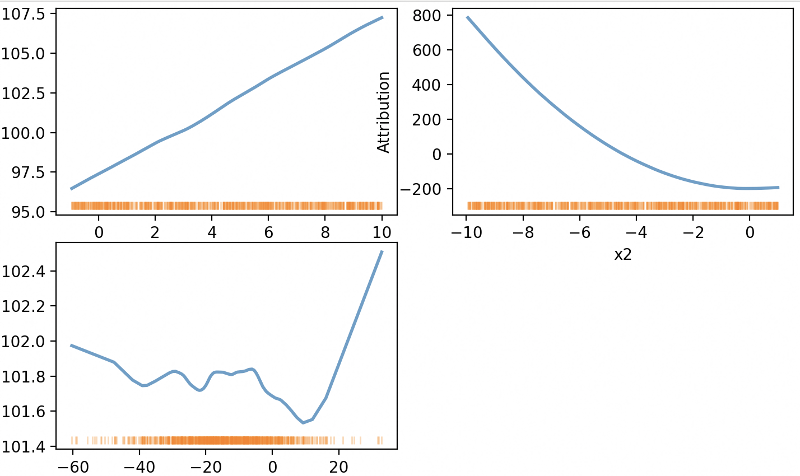

# GAM

GAM (Generalized Additive Model) implements an interpretable model that learns shape functions for each feature through combinatorial optimization. The model supports both static and interactive visualizations of feature contributions.

## Class Definition

```python
class mindxlib.GAM(
    feature_prefix: str = 'feature_',
    max_iter: int = 100,
    step_size: float = 1,
    block_size: int = 50,
    lambda_1: float = 0.1,
    eta: float = 0.01,
    momentum: float = 0.9,
    momentum_type: str = 'Huber',
    reg_type: str = 'Huber',
    bin_num: int = 64,
    randomize: bool = False,
    verbose: bool = False
)
```

### Parameters

- **feature_prefix** : `str`, default='feature_'
  - Prefix for auto-generated feature names

- **max_iter** : `int`, default=100
  - Maximum number of iterations for training

- **step_size** : `float`, default=1
  - Step size for gradient updates

- **block_size** : `int`, default=50
  - Block size for optimization

- **lambda_1** : `float`, default=0.1
  - Regularization parameter

- **eta** : `float`, default=0.01
  - Learning rate parameter

- **momentum** : `float`, default=0.9
  - Momentum parameter for optimization

- **momentum_type** : `str`, default='Huber'
  - Type of momentum ('Huber' or 'L2')

- **reg_type** : `str`, default='Huber'
  - Type of regularization ('Huber' or 'L2')

- **bin_num** : `int`, default=64
  - Number of bins for discretizing continuous features

- **randomize** : `bool`, default=False
  - Whether to use randomization in optimization

- **verbose** : `bool`, default=False
  - Whether to print progress during training

## Methods

### fit()

Fit the GAM model to training data.

```python
def fit(
    X: Union[pd.DataFrame, np.ndarray],
    y: Union[pd.Series, np.ndarray],
    sample_weights: Optional[np.ndarray] = None,
    category_features: Optional[List[int]] = None
) -> GAM
```

**Parameters:**
- **X** : `pd.DataFrame` or `np.ndarray`
  - Feature matrix of shape (n_samples, n_features)

- **y** : `pd.Series` or `np.ndarray`
  - Target values of shape (n_samples,)

- **sample_weights** : `np.ndarray`, optional
  - Sample weights of shape (n_samples,)

- **category_features** : `List[int]`, optional
  - Indices of categorical features

**Returns:**
- Fitted `GAM` instance

### predict()

Make predictions using the fitted model.

```python
def predict(X: Union[pd.DataFrame, np.ndarray]) -> np.ndarray
```

**Parameters:**
- **X** : `pd.DataFrame` or `np.ndarray`
  - Test data of shape (n_samples, n_features)

**Returns:**
- `np.ndarray` of predicted values, shape (n_samples,)

### show()

Visualize the GAM model's shape functions and feature contributions.

```python
def show(
    data: Union[pd.DataFrame, np.ndarray],
    mode: str = 'static',
    port: int = 8082,
    waterfall_height: str = "40vh",
    intercept: bool = False,
    auto_open: bool = True,
    ci: bool = True,
    alpha: float = 0.05,
    **kwargs
) -> None
```

**Parameters:**
- **data** : `pd.DataFrame` or `np.ndarray`
  - Data to visualize shape functions for

- **mode** : `str`, default='static'
  - Visualization mode ('static' or 'interactive')

- **port** : `int`, default=8082
  - Port for interactive visualization server

- **waterfall_height** : `str`, default="40vh"
  - Height of waterfall plot in interactive mode

- **intercept** : `bool`, default=False
  - Whether to include intercept in calculations

- **auto_open** : `bool`, default=True
  - Whether to automatically open interactive visualization

- **ci** : `bool`, default=True
  - Whether to show confidence intervals

- **alpha** : `float`, default=0.05
  - Significance level for confidence intervals

## Examples

### Basic Usage

```python
from mindxlib import GAM
import numpy as np
import pandas as pd
from sklearn.metrics import mean_squared_error, r2_score

# Generate synthetic data
def generate_synthetic_data(n_samples=1000, noise_level=0.1, random_state=42):
    """
    y = x1 + 10*x2^2 - sin(x3^3) + e
    """
    np.random.seed(random_state)
    
    x1 = np.random.uniform(-1, 10, n_samples)
    x2 = np.random.uniform(-10, 1, n_samples)
    x3 = np.random.normal(-15, 15, n_samples)
    
    noise = np.random.normal(0, noise_level, n_samples)
    y = x1 + 10 * (x2 ** 2) - np.sin(x3 ** 3) + noise
    
    X = pd.DataFrame({
        'x1': x1,
        'x2': x2,
        'x3': x3
    })
    
    return X, y

# Create data and split into train/test
X, y = generate_synthetic_data()
train_size = int(0.8 * len(X))
X_train, X_test = X[:train_size], X[train_size:]
y_train, y_test = y[:train_size], y[train_size:]

# Initialize and fit GAM model
gam = GAM(max_iter=200, lambda_1=0.01, verbose=True, bin_num=64)
gam.fit(X_train, y_train)

# Make predictions
y_pred = gam.predict(X_test)

# Calculate performance metrics
mse = mean_squared_error(y_test, y_pred)
r2 = r2_score(y_test, y_pred)
print(f"Mean Squared Error: {mse:.4f}")
print(f"R² Score: {r2:.4f}")

# Show static visualization
gam.show(X_test, mode='static')
```

The static visualization shows shape functions for all features, displaying how each feature contributes to the prediction across its range of values:



The interactive visualization builds upon this view by adding a waterfall plot and interactive features. When hovering over a feature in the waterfall plot, its corresponding shape function is brought to the front:

```python
# Show interactive visualization
gam.show(
    X_test,
    mode='interactive',
    port=8082,
    waterfall_height="40vh",
    ci=True,
    alpha=0.05
)
```

## References

1. Yang, Linxiao, Ren, Rui, Gu, Xinyue, & Sun, Liang. (2023). Interactive Generalized Additive Model and Its Applications in Electric Load Forecasting. In *Proceedings of the 29th ACM SIGKDD Conference on Knowledge Discovery and Data Mining* (pp. 5393-5403).